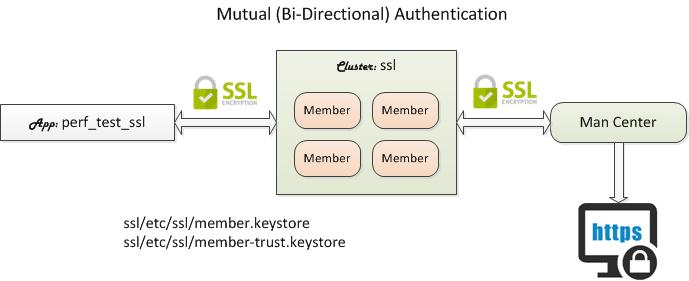

# IMDG Cluster: ssl

As part of the TLS/SSL lab of Hazelcast Operations Training, the `ssl` cluster has been preconfigured to enable SSL. It contains scripts to create both private and trust keystores that contain both member and client keys and certificates.

## Installing Bundle

```bash
install_bundle -download bundle-hazelcast-training-3n4-app-perf_test_ssl-cluster-ssl
```

## Use Case

*This bundle is for training use only.* As part of the TLS/SSL lab, this bundles includes a cluster and an app preconfigured with private and trust keytstores.



## Creating Keystores

To create keystores, follow the instructions in the Hazelcast Operations Training slide deck or the steps in the order shown below. 

### 1. Initialize Environment

First, intialize your bundle environment to your workspace's Hazelcast version. The followin scripts places the correct configuration files to their respective `etc/` directories.

```bash
# Initialize client
cd_app perf_test_ssl; cd bin_sh
./init_app

# Initialize cluster
switch_cluster ssl; cd bin_sh
./init_cluster
```

### 2. Member Keystore

```console
# Switch cluster and cd into the bin_sh directory.
# All commands must be executed inside the bin_sh directory
# with the './' prefix.
switch_cluster ssl; cd bin_sh

# Create member keystore to store private keys.
./create_member_keystore

# List private keys in the member keystore.
# You should see one (1) key.
./list_member_keystore
```

### 3. Member Trust Keystore

``` console
# Create members’s trust keystore (Export the trusted certificate
# and import it in the trust keystore)
./create_member_trust_keystore

# List the trusted certificates  in the trust keystore you just created.
./list_member_trust_keystore
```

### 4. Client Keystore

```console
# Change directory to the perf_test_ssl app
cd_app perf_test_ssl; cd bin_sh

# Create the client’s private keystore
./create_client_keystore
```

### 5. Client Trust Keystore

```console
# Create client’s trust keystore
# (Export the trusted certificate and import it in the trust keystore)
./create_client_trust_keystore

# List the trusted certificates  in the trust keystore you just created.
# You should see one (1) trusted certificate.
./list_client_trust_keystore

# Import the member’s trusted certificate into the client’s
# trust keystore.
./import_member_trusted_certificate

# List the client’s trust keystore.
# You should now see two (2) trusted certificates (member and client).
./list_client_trust_keystore
```

### 6. Import Client Key to Member Keystore

```console
# Change directory to the cluster’s bin_sh directory 
cd_cluster ssl; cd bin_sh

# Import client’s private key to member’s keystore
./import_client_key

# List the keys in the member’s keystore
# You should see 2 private keys (member and client)
./list_member_keystore

```

### 7. Import Client Trusted Certificate

```console
# Import the client’s trusted certificate into the member’s 
# trust keystore.
./import_client_trusted_certificate

# List client’s trust keystore
# You should see 2 trusted certificates (member and client)
./list_member_trust_keystore
```

## 8. Start Cluster

```console
# First, add members. Bundles do not include members.
add_member
add_member

# Start cluster.
start_cluster

# See the log file to see SSL messages.
show_log
```

## 9. Run Client

```console
# Change directory to the perf_test’s bin_sh directory
cd_app perf_test_ssl; cd bin_sh

# Run the perf_test ingestion program
./test_ingestion -run

# See SSL outputs
```

## 10. Start Management Center

Management Center has also been configured with TLS/SSL using the member's keystore. After starting the MC, obtain the HTTPS URL by running `show_mc`. 

```console
start_mc
show_mc
```

URL: https://localhost:8443/hazelcast-mancenter

## Browser Notes

Note that depending on your browser, `localhost` in URL may not work. Use the host name instead if it fails. The private key has been generated with your host name as one of domain names.

:exclamation: **Chrome Users:** Chrome might block you completely from visiting the Management Center site due to the self-signed certifcate. In that case, try clicking on any where on the page and typing **thisisunsafe**.

### Hazelcast Management Center 4.x

If you are running  Hazelcast Management Center 4.x, then you must upload the `etc/hazelcast-client-mc.xml` configuration file to the Management Center. This file has been generated when you executed the `init_app` script in the beginning of the tutorial. This file configures SSL settings with the absolute paths to the client keystore files that we generated earlier.

```
cd_app perf_test_ssl
cat etc/hazelcast-client-mc.xml
```

In the browser, upload the above file as follows:

- Select **Manage Cluster** from the left pane.
- Selecct **Add Cluster Config** 
- Select the **Upload Config File** button.
- Drag and dop the `hazelcast-client-mc.xml` file into the dotted box.
- Select the **Save** button to save the file.

## Teardown

```console
stop_cluster
stop_mc
```
